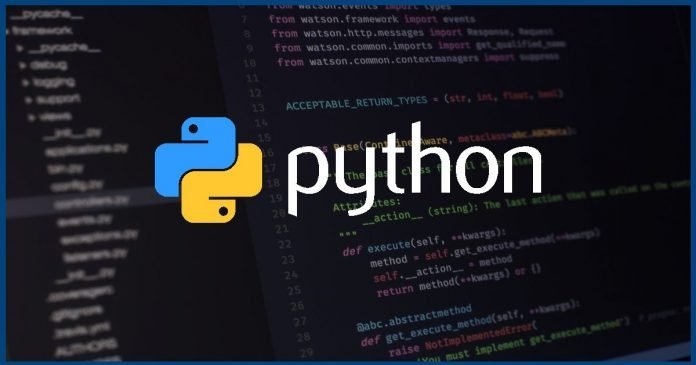
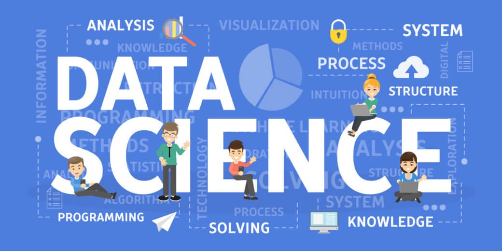

## Higher Diploma in Data Analytics
### Karolina Szafran-Belzowska, G00376368


A conversion course for graduates of level 8 programmes in disciplines other than computing, the aim of this programme is to provide students with a broad knowledge of computing, 
with a specialisation in data analytics. 
This will enable students to apply data analysis techniques to the topics in their original degree, while also providing a foundation on which they can develop their skills in 
the more traditional areas of computing. 
The course covers such skills as automating manual spreadsheet-oriented data analysis processes, converting large data sets into actionable information, and creating web-based 
dashboards for visualising data. 
Level 8 graduates from disciplines such as business and finance are particularly suited to this course, as are those from life and physical sciences.


### Modules
________________________________________

1. Programming and Scripting	(10 credits)
2. Computational Thinking with Algorithms	(5 credits)
3. Computer Architecture and Technology Convergence	(5 credits)
4. Data Representation	(5 credits)
5. Fundamentals of Data Analysis	(5 credits)
6. Programming for Data Analysis	(10 credits)
7. Applied Databases	(5 cedits)
8. Web Application Development	(5 credits)
9. Machine Learning and Statistics	(5 credits)
10. Multi-paradigm programming	(5 credits)
11. Work Placement or Project	(15 credits)

### Learning outcomes:
________________________________________
The learner will have knowledge and understanding of advanced concepts in the following areas.
1.	Data analysis: collecting, cleaning, processing, exploring and modelling.
2.	Programming: iteration, conditions, abstraction, procedures.
3.	Mathematical foundations: numerical software, regression, hypothesis testing.
4.	Professional issues: summarisation of results, presentation, decision making.

The learner will be able to:
1.	Identify real-world problems that are well suited to data analysis; Recognise, understand and appreciate techniques in computational data analytics; Describe the limitations of current techniques and technologies in computing and data analytics.
2.	Model real world problems from a data analytics perspective; Design and construct a data analytics workflow to solve a data-intensive computational problem; Identify, analyse and plan strategies for solving general computational problems.
3.	Identify and select appropriate data analysis techniques in a range of real-world contexts; Apply quality concepts to computer programming and data analytics workflows; Manage a computer-based project throughout all stages of its lifecycle.
4.	Apply best practice in the fields of computing and data analytics; Apply diagnostic skills in a range of data-focused contexts; Discuss, plan and implement fundamental techniques in computing, including programming.
5.	Work autonomously in solving problems using a computer; Plan and track the development of software by a group of people; Recognise the different roles involved in organising a project in data analysis.
6.	Locate and evaluate documentation and information through online research; Assimilate new skills and techniques in computing through online learning; Criticise computational work in a constructive manner.
7.	Critique the ways in which data analysis affects the world; Summarise how academic and industrial research leads to new knowledge, solutions and techniques in data analysis; Recommend an appropriate course of action based on results from data analysis.

 
### 1. Programming and Scripting
________________________________________


This module is an introduction to automating computer tasks using scripting languages and solving problems using programming languages, with a focus on
data. It covered the high-level concepts and the theory.

#### Learning Outcomes

1. Automate computer tasks using a scripting language.
2. Write configuration files for a variety of software applications.
3. Setup and configure a software development environment and toolchain.
4. Develop an algorithm to solve a computational problem.
5. Write a computer program in a high-level programming language.
6. Construct a complex computer program from a series of simpler computer programs

#### How download this repository

1. Go to Github and select Programming and Sripting - Jupyter notebook or Programming and Scripting - VSC.
2. Click the download button.

#### How to run the project (Visual Studio Code)
1. Make sure you have Python installed. https://www.python.org/downloads/
2. Download Python using Anaconda and use iPython. https://www.anaconda.com/distribution/
3. Anaconda allows you to use software such as Visual Studio Code. https://code.visualstudio.com/download
5. Download Vivual Studio Code, this will assist you in saving annd editing your code.
6. Install Cmder in Windows to allow you run the code used in this repository. https://cmder.net/
7. Open a command winder and use ipython.

#### How to run the project (Jupyter notebook)
The project is also written in Jupyter notebook and it is called "Programming and Scripting.ipynb", where the Data is summarized. How to run the Jupyetr Notebook? - see the bottom of this README file.

#### References:
- https://www.sololearn.com/; 
- https://docs.python.org/3/library/: 
- https://www.youtube.com/; 
- https://stackoverflow.com/; 
- https://en.wikipedia.org/wiki/Iris_flower_data_set 
- https://www.geeksforgeeks.org/python-pandas-series/;
- https://github.com/RitRa/Project2018-iris 
- https://machinelearningmastery.com/python-machine-learning-mini-course/; 
- https://help.github.com/en/articles/adding-a-file-to-a-repository; 
- https://guides.github.com/features/mastering-markdown/; 
- https://stackoverflow.com/questions/33889310/r-summary-equivalent-in-numpy; 
- https://www.youtube.com/watch?v=hd1W4CyPX58 
- http://blog.kaggle.com/2015/04/22/scikit-learn-video-3-machine-learning-first-steps-with-the-iris-dataset/; 
- https://pandas.pydata.org/pandas-docs/stable/reference/api/pandas.DataFrame.html; 
- https://www.kaggle.com/abhishekkrg/python-iris-data-visualization-and-explanation; 
- http://scipy-lectures.org/packages/statistics/index.html#statistics


### 2. Computational Thinking with Algorithms
________________________________________


This repository contains the benchmarking code for five different sorting algorithms as part of the assessment in the Computational Thinking with Algorithms module for the Higher Diploma in Data Analytics with Galway-Mayo Institute of Technology.

The module covers a comprehensive foundation in computational problem solving and algorithm design. 

### Learning Outcomes
1. Apply structured methodologies to problem solving in computing.
2. Design algorithms to solve computational problems.
3. Critically evaluate and assess the performance of algorithms.
4. Translate real-world problems into computational problems

### Project Description
This project implements functions for and benchmarks five sorting algorithms:

- Bubble Sort,
- Counting Sort,
- Insertion Sort,
- Merge Sort,
- Selection Sort

The benchmarking process begins with the creation of arrays of random integer arrays of increasing size, each of which are passed to all of the sorting functions. The sorting functions are timed with each array ten times to get an average time for each input size and the results are collated in a dataframe. 

It should be noted that due to the nature of the simple sorting algorithms, the code herein may take quite some time to run as they attempt to sort the larger input sizes.

The project is written in Jupyter notebook and it is called "CTA.ipynb", where the Data is summarized. 
How to run the Jupyetr Notebook? - see the bottom of this README file.

#### References:
- https://whatis.techtarget.com/definition/sorting-algorithm
- https://www.studytonight.com/data-structures/introduction-to-sorting
- https://en.wikipedia.org/wiki/Sorting_algorithm
- https://en.wikipedia.org/wiki/Best,_worst_and_average_case
- https://www.geeksforgeeks.org/g-fact-86/
- https://en.wikipedia.org/wiki/Big_O_notation
- https://rob-bell.net/2009/06/a-beginners-guide-to-big-o-notation/
- https://medium.com/better-programming/a-gentle-explanation-of-logarithmic-time-complexity-79842728a702
- http://mca.kiet.edu/webguru/unit-1ds.html
- https://www.baeldung.com/cs/stable-sorting-algorithms
- https://stackoverflow.com/questions/25788781/definition-of-non-comparison-sort
- https://en.wikipedia.org/wiki/Comparison_sort
- https://www.geeksforgeeks.org/time-complexities-of-all-sorting-algorithms/
- https:/www.interviewcake.com/concept/java/counting-sort
- https://www.blog.pythonlibrary.org/2016/05/24/python-101-an-intro-to-benchmarking-your-code/
- https://www.tutorialspoint.com/python_data_structure/python_sorting_algorithms.htm

**Also viewed:**
- https://numpy.org
- https://www.w3schools.com
- https://pandas.pydata.org
- https://www.geeksforgeeks.org
- https://datatofish.com
- https://matplotlib.org
- https://docs.python.org
- https://stackoverflow.com
- https://runestone.academy/runestone/books/published/pythonds/SortSearch/TheBubbleSort.html
  https://runestone.academy/runestone/books/published/pythonds/SortSearch/TheSelectionSort.html
  https://runestone.academy/runestone/books/published/pythonds/SortSearch/TheMergeSort.html
  https://runestone.academy/runestone/books/published/pythonds/SortSearch/TheInsertionSort.html
**Videos:**
- https://www.youtube.com/watch?v=AthG28-_RuM&t=445s
- https://www.youtube.com/watch?v=AgtzMtrzhzs
- https://www.youtube.com/watch?v=JxTghISBmI8
- https://www.youtube.com/watch?v=3aTfQvs-_hA
**Github Repositories:**
- https://github.com/jennifer-ryan/benchmarking-sorting-algorithms
- https://github.com/andkoc001/CTA_sorting_project
- https://github.com/johndunne2019/CTA-Project-Benchmarking-Sorting-Algorithms
- https://gist.github.com/haandol/a5df913cfd278820e43e
- https://github.com/Thalmann/counting_sort/blob/master/counting_sort.py

### 3. Computer Architecture and Technology Convergence
________________________________________


This repository contains the assessment in the Computer Architecture and Technology Convergence module for the Higher Diploma in Data Analytics with Galway-Mayo Institute of Technology.

The module introduces you to the inner workings, structure, architecture and organization of modern computer architectures.

The project is written using a standard word processor and .pdf format.

#### Learning Outcomes

1. Demonstrate an understanding of the components in modern computer architectures.
2. Troubleshoot common computer hardware and software problems.
3. Describe the topologies of computer networks.
4. Explain the role of abstraction in the development of computer hardware and software.

#### References:
- https://www.cyberciti.biz/faq/save-file-in-vi-vim-linux-apple-macos-unix-bsd/
- http://linuxcommand.org/lc3_wss0010.php
- https://unix.stackexchange.com/questions/47584/in-a-bash-script-using-the-conditional-or-in-an-if-statement
- https://stackoverflow.com/questions/13593771/repeat-command-automatically-in-linux
- https://linuxhint.com/bash-while-loop-examples/
- https://stackoverflow.com/questions/18488651/how-to-break-out-of-a-loop-in-bash
- https://unix.stackexchange.com/questions/184631/bash-ubuntu-strings-in-while-loops
- https://www.youtube.com/watch?v=IvHt_S3aYG4
- https://www.tutorialspoint.com/unix/unix-basic-operators.htm


### 4. Data Representation
________________________________________


This repository contains the assignment of the Data Representation module for the Higher Diploma in Data Analytics with Galway-Mayo Institute of Technology.
This module in which I was investigating and operating the protocols, standards and architectures used in representing data, with a focus on
interacting with data services across the Internet. I also gained practical experience in developing applications that interact with such data.

#### Learning Outcomes: (https://www.gmit.ie/sites/default/files/public/computing/docs/data-representation.pdf)
1. Compare data models and architectures used in applications.
2. Write software applications that adhere to common standards and protocols.
3. Explain the basic mechanisms by which application data is transmitted across the internet.
4. Design and utilise application programming interfaces for interacting with data sources.

#### The repository contains:
- README.md file
- .gitignore
- requirements.txt - stores required packages
- mySQL database
- Python 'DAO' programme to access the mySQL database, this programme consumes an API. (EmployeeDAO.py, testEmployeeDAO.py- it was used to test the DAO.)
- Python 'application' to run a Flask server (server.py) in a virtual enviroment
- createDBproject.py - code to create the database ('dr_project')
- employee.html page
- employee.png

#### AJAX
A technique of creating web applications in which user interaction with the server takes place without reloading the entire document, in an asynchronous manner. This is to allow more dynamic interaction with the user than in the traditional model where every word applies to all HTML pages.

#### DAO
DAO stands for Data Access Object. The EmployeeDAO.py file consists of a number of functions which access the database and perform CRUD operations. It is a pattern that provides an abstract interface to some type of database or other persistence mechanism. The DAO provides some specific data operations without exposing details of the database.

#### How to run
At the command prompt: For those who do not have 'flask' and 'mysql-connector' installed:
```
pip install flask
pip install mysql-connector
```
In the command prompt type command: python server.py. to make the server running (at http://127.0.0.1:5000). In the browser address bar: http://127.0.0.1:5000/employee.html - starts the web interface that uses AJAX to perform database.

#### MySQL database & table
Database = dr_project Table = employee

MySQL command to create employee table:
```
create table employee (
    employee_ID int NOT NULL PRIMARY KEY,
    employee_Name varchar(100),
    employee_Dept_ID int,
    employee_Salary int
);
```
#### References:
- https://en.wikipedia.org/wiki/Data_access_object, 05/12/2020
- https://pl.wikipedia.org/wiki/AJAX, 08/12/2020
- https://www.w3schools.com/xml/ajax_intro.asp,08/12/2020
- https://github.com/andrewbeattycourseware/dataRepresenation2020
- GMIT Video Lectures, Andrew Beatty

### 5. Fundamentals of Data Analysis
________________________________________


This repository contains my assessment for the module "Fundamentals of Data Analysis" at Galway-Mayo Institute of Technology. 

The module Fundamentals of Data Analysis is an introduction to the fundamentals of data analysis, including the acquisition, cleaning and exploration of data sets.

#### Learning Outcomes https://www.gmit.ie/sites/default/files/public/computing/docs/fundamentals-data-analysis.pdf
1. Source and investigate sets of data.
2. Programmatically explore and visualise data.
3. Apply basic mathematical data analysis techniques to data sets.
4. Write programs to automate basic data analysis techniques.

#### Attribute information of the project:
- Total_bill in $,
- Tip in $,
- Sex of tipper: Female or Male,
- Smoker: Yes or No,
- Day: Thursday to Sunday,
- Meal: Lunch or Dinner,
- and size of the table.

#### How to run the project
The project is written in Jupyter notebook and it is called "Fundamentals of Data Analysis - tips dataset.ipynb", where the Data is summarized. The project also contains "tipsdata.csv" and "tips.jpg" (file with Photo of TIPS).
How to run the Jupyetr Notebook? - see the bottom of this README file.

### 6. Programming for Data Analysis
________________________________________


This module develops programming skills towards the effective use of data analysis libraries and software.
I have learnt how to select efficient data structures for numerical programming, and to use these data structures to transform
data into useful and actionable information.

#### Learning Outcomes https://www.gmit.ie/sites/default/files/public/computing/docs/programming-data-analysis.pdf

1. Perform exploratory analysis on data.
2. Programmatically create plots and other visual outputs from data.
3. Design computer algorithms to solve numerical problems.
4. Create software that incorporates and utilises standard numerical libraries.
5. Employ appropriate data structures when programming for data-intensive applications.
6. Model real-world, data-intensive problems as computing problems.

This assignment on numpy.random is the part of the Programming for Data Analysis 2019 module at Galway-Mayo Institute of Technology. It contains the numpy.random package in Python. In this assignment I tried to explain in details the use of the numpy.random package in Python using explanations and examples. I created a jupyter notebook and use this to show examples of numpy.random and its uses.

#### There are 4 main sections in this assignment
1. Explain the overall use of the numpy.random package.
2. Explain the use of the "Simple random data" and Permutations" functions.
3. Explain the use and purpose of at least five "Distributions" functions.
4. Explain the use of seeds in generating pseudorandom numbers.

#### References:
- https://www.researchgate.net/publication/332464628_Factors_that_affect_the_choice_of_Consumers_in_selecting_Retail_Store_for_Grocery_Shopping [Accessed 01/12/19]
- http://www.tuttofood.it/en/blog/influencing-factors-grocery-shopping [Accesed 01/12/19]
- https://www.statista.com/statistics/493800/factors-considered-by-us-consumers-in-choosing-stores-for-grocery-shopping/ [Accessed 01/12/19]
- https://www.theguardian.com/business/2015/jan/30/tesco-cuts-range-products [Accessed 01/12/19]
- https://www.eatthis.com/top-food-trends-2020/ [Accessed 01/12/19]
- https://web.microsoftstream.com/video/20c35691-a985-4379-bfa3-a63828360881?list=user&userId=20b32719-41e8-4560-9f7f-c83ba751229c [Accessed 02/12/19]
- https://www.treehugger.com/green-food/why-do-people-buy-organic.html [Accessed 02/12/19]
- http://organictrust.ie/info/10_reasons_for_choosing_to_buy_organic_food [Accessed 02/12/19]
- https://www.geeksforgeeks.org/different-ways-to-create-pandas-dataframe/ [Accessed 02/12/19]
- https://towardsdatascience.com/synthetic-data-generation-a-must-have-skill-for-new-data-scientists-915896c0c1ae [Accessed 02/12/19]
- https://www.researchgate.net/publication/239781750_Age_gender_and_income_Do_they_really_moderate_online_shopping_behaviour [Accessed 06/12/19]
- https://ec.europa.eu/eurostat/statistics-explained/index.php/E-commerce_statistics_for_individuals [Accessed 06/12/19]
- https://pynative.com/python-get-random-float-numbers/ [Accessed 08/12/19]
- https://www.geeksforgeeks.org/numpy-median-in-python/ [Accessed 09/12/19] 
- https://stackoverflow.com/questions/12207833/how-to-get-the-max-value-out-of-a-random-list-of-numbers-python [Accessed 09/12/19]
- https://www.geeksforgeeks.org/python-statistics-median/ [Accessed 09/12/19]
- https://www.citizensinformation.ie/en/reference/checklists/checklist_at_what_age_can_i.html [Accessed 14/12/19]
- https://www.citizensinformation.ie/en/justice/criminal_law/criminal_offences/alcohol_and_the_law.html [Accessed 14/12/19]
- https://www.irishtimes.com/news/bill-will-raise-to-18-minimum-age-to-purchase-tobacco-1.253232 [Accessed 14/12/19]
- https://www.thesun.co.uk/news/9518161/national-lottery-age-limit-could-rise-from-16/ [Accessed 15/12/19]
- https://plot.ly/python/histograms/ [Accessed 09/12/19]
- https://pandas.pydata.org/pandas-docs/stable/reference/api/pandas.Series.value_counts.html [Accessed 15/12/19]
- https://www.tastetomorrow.com/inspiration/how-to-benefit-from-the-instagrammable-food-trend/381/ [Accessed 15/12/19]
- https://www.natureswayfoods.com/discover/fresh-results/food-to-go/ [Accessed 15/12/19]
- Food trends. Available online at: https://www.trendhunter.com/slideshow/chilled-snack [Accessed 15/12/19]
- https://www.cbsnews.com/news/diet-trends-for-2019-what-to-try-what-to-skip/ [Accessed 15/12/19]

### 7. Applied Database
________________________________________


This module is a comprehensive primer on databases, with a focus on data analysis. The creation, retrieval, update and deletion of both structured and
unstructured data will be covered for a number of modern database systems and architectures.

### Learning Outcomes https://www.gmit.ie/sites/default/files/public/computing/docs/applied-databases.pdf
1. Create, retrieve, update and delete data in a variety of modern database management systems.
2. Determine the correct data to select from a database in order to perform a given data analysis.
3. Select an appropriate interface to access a database for a given application.
4. Determine the best balance between application and database logic for a given data analysis process.

#### References:
- https://www.import.io/post/what-is-data-normalization-and-why-is-it-important/ (02/08/2020)
- https://www.geeksforgeeks.org/difference-between-primary-key-and-foreign-key/ (02/08/2020)
- https://www.w3schools.com/sql/sql_foreignkey.asp (02/08/2020)
- https://en.wikipedia.org/wiki/Third_normal_form (02/08/2020)
- 
***GitHub Repositories"***
- https://github.com/NiamhOL?tab=repositories
- https://github.com/g00387822
- https://github.com/ClodaghMurphy?tab=repositories
- https://github.com/angela1C?tab=repositories
- https://github.com/johndunne2019?tab=repositories
- 
***Other Web pages:***
- https://www.datacamp.com/community/tutorials/mysql-python
- https://dev.mysql.com/doc/connector-python/en/connector-python-example-connecting.html
- https://pypi.org/project/PyMySQL/
- https://www.w3schools.com/python/python_mongodb_insert.asp
- https://docs.mongodb.com/manual/reference/operator/
- https://dev.mysql.com/doc/refman/5.6/en/non-typed-operators.html
- The lecture slides presented in the course – Module: Applied Databases, Gerard Harrison – Higher Diploma in Data Analytics,  GMIT, 2020


### 8. Web Application Development
________________________________________


This module introduced to modern web application and network application development using frameworks in high-level
programming and scripting languages. The focus was on building light-weight network services, particularly web-based services, and integrating
those services with modern front-end frameworks.

#### Learning Outcomes https://www.gmit.ie/sites/default/files/public/computing/docs/web-application-development.pdf
1. Describe the common architectures of web applications.
2. Create scalable web services using modern architectural patterns.
3. Create a web application using a server-side framework.
4. Manage the development of a web application.

#### References:
Webpages:
- https://www.youtube.com/watch?v=2S1AbEWX85o
- https://www.tutorialsteacher.com
- https://www.w3schools.com
- https://css-tricks.com
- https://www.techonthenet.com
- https://www.codecademy.com
- https://htmldog.com/guides/html/beginner/
- https://www.javatpoint.com/html-tutorial

GitHub Repositories:
- https://github.com/d3
- https://github.com/Roisin-Fallon
- https://github.com/andkoc001
- https://github.com/shkyler
- https://github.com/NiamhOL

Lecture Notes:
- dr. Michael Duignan (2020), Lecture notes  for Web Application Development, 
 Higher Diploma in Science (Data Analytics), Galway Mayo Institute of Technology. 


### 9. Machine Learning and Statistics
________________________________________


This module was an introduction to machine learning and the statistical aspects surrounding the theory.

**Machine Learning and Statistics - tasks**

This task assessment has been carried out as an assignment of the Machine Learning and Statistic module of the Higher Diploma In Data Analytics at GMIT.
The assessment was implemented in Jupyter Notebook (tasks.jpynb) using the Python programming language.

The project is written in Jupyter notebook and it is called "MLS tasks.ipynb", where the Data is summarized. 
How to run the Jupyetr Notebook? - see the bottom of this README file.

***Task 1:*** Square root of 2 function.

Write a Python function called sqrt2 that calculates and prints to the screen the square root of 2 to 100 decimal places. Your code should not depend on any module from the standard library1 or otherwise. You should research the task first and include references and a description of your algorithm.

***Task 2:*** Chi-squared Test for Indendence.

The Chi-squared test for independence is a statistical hypothesis test like a t-test. It is used to analyse whether two categorical variables are independent. The Wikipedia article gives the table below as an example, stating the Chi-squared value based on it is approximately 24.6. Use scipy.stats to verify this value and calculate the associated p value. You should include a short note with references justifying your analysis in a markdown cell.

***Task 3:*** Microsoft Excel function for Standard Deviation.

The standard deviation of an array of numbers x is calculated using numpy as np.sqrt(np.sum((x - np.mean(x))**2)/len(x)) . However, Microsoft Excel has two different versions of the standard deviation calculation, STDEV.P and STDEV.S . The STDEV.P function performs the above calculation but in the STDEV.S calculation the division is by len(x)-1 rather than len(x) . Research these Excel functions, writing a note in a Markdown cell about the difference between them. Then use numpy to perform a simulation demonstrating that the STDEV.S calculation is a better estimate for the standard deviation of a population when performed on a sample. Note that part of this task is to figure out the terminology in the previous sentence.

***Task 4:*** k-means clustering of Ronald Fisher’s famous Iris flower data set.

Apply k-means clustering Ronald Fisher’s famous Iris flower data set using scikit-learn. Explain the k-means clustering code and accuracies achieved. Explain how the model could be used to make a prediction of the iris species.

**Machine Learning and Statistics - project**

This project creates a web service that uses machine learning to make predictions based on the dataset powerproduction. The goal is to produce a model that accurately predicts wind speed values. The web service will respond with predicted power values based on speed values sent as HTTP requests. The assignment was implemented in Python Language. 

#### Learning Outcomes https://www.gmit.ie/sites/default/files/public/computing/docs/machine-learning-statistics.pdf
1. Describe the stochastic nature of real-world measurements.
2. Select an appropriate mathematical model of a real-world problem.
3. Select an appropriate cost function for a given machine learning task.
4. Apply an optimisation technique to the parameters of a model.

#### Packages used in this project
- Python 3 https://docs.python.org/3/
- Numpy http://www.numpy.org/
- Jupyter Notebook https://jupyter.org/
- Pandas https://pandas.pydata.org/
- Scipy.stats https://docs.scipy.org/doc/scipy/reference/stats.html
- Matplotlib.pylab https://matplotlib.org/
- Flask https://flask.palletsprojects.com/en/1.1.x/
- Seaborn https://seaborn.pydata.org/
- Tensorflow.keras https://www.tensorflow.org/, https://keras.io/
- Scikit-learn https://scikit-learn.org/stable/

#### References:
- https://github.com/ianmcloughlin/jupyter-teaching-notebooks/blob/master/keras-neurons.ipynb, 02/01/2021
- https://keras.io/, 02/01/2021
- https://en.wikipedia.org/wiki/Wind_turbine, 03/01/2021
- https://www3.ntu.edu.sg/home/, 03/01/2021
- https://machinelearningmastery.com/, 03/01/221
- https://www.w3schools.com/python/
- https://en.wikipedia.org/wiki/Wind_turbine
- https://en.wikipedia.org/wiki/Wind_power
- https://ksopyla.com/machine-learning/modele-regresji-liniowej-z-scikit-learn/
- https://ichi.pro/pl/algorytm-regresji-liniowej-od-podstaw-w-pythonie-253366674175694

**GitHub repositories:**

- https://github.com/Freeha-S?tab=repositories
- https://github.com/doriszd?tab=repositories
- https://github.com/johndunne2019?tab=repositories
- https://github.com/andkoc001?tab=repositories
- https://github.com/IanWafer?tab=repositories

### 10. Multi-paradigm programming
________________________________________


This module was an introduction to various programming paradigms, such as object-oriented programming, functional programming and dataflow
programming.

The task of this project assignment is to apply two different programming paradigmns to solve a problem. 
The assignment was implemented in C Procedural Language, Python Procedural and Object-Oriented Programming Language.

**C programming language** is an example of a procedural programming paradigm. Beacuse of its long legacy, the language may be considered old fashioned and also a relatively low-level in terms of memory management. **Python** is a multi-paradigm programming language. The program here has been written to mimic a program written in C. To achieve this, a data type *data class* has been used that resembles the *struct* data type in C. Python supports also **the object oriented (OOP) programming** paradigm. This paradigm avails of several new concepts, which can be very benefitial in dealing with some programming problems. First of all, there are objects, which combine data and the methods.  

#### Learning Outcomes https://www.gmit.ie/sites/default/files/public/computing/docs/multi-paradigm-programming.pdf
1. Compare different programming paradigms.
2. Select an appropriate programming paradigm for a given programming problem.
3. Write programs using a variety of different programming paradigms.
4. Explain how various programming paradigms have evolved over time.

#### References:
- https://slideplayer.com/slide/2811690/, 27/12/2020
- https://en.wikipedia.org/wiki/Programming_paradigm, 22/12/2020
- https://www.computerhope.com/jargon/i/imp-programming.htm, 22/12/2020
- https://en.wikipedia.org/wiki/Dennis_Ritchie
- https://www.computerhope.com/jargon/c/c.htm, 27/12/2020
- https://en.wikipedia.org/wiki/C_(programming_language), 27/12/2020
- https://blog.eduonix.com/featured/2019-survey-stackoverflow-know/, 27/12/2020
- https://en.wikipedia.org/wiki/Python_(programming_language), 27/12/2020
- https://en.wikipedia.org/wiki/Guido_van_Rossum, 27/12/2020
- https://www.tiobe.com/tiobe-index/, 27/12/2020
- https://www.geeksforgeeks.org/python-features/, 27/12/2020
- https://towardsdatascience.com/python-procedural-or-object-oriented-programming-42c66a008676, 27/12/2020
- https://www.educba.com/c-vs-python/, 27/12/2020
#### Also reviewed:
- Dr Dominic Carr – Lecture materials : https://learnonline.gmit.ie/course/view.php?id=1902
- https://docs.python.org
- https://github.com/realpython
- https://www.stavros.io/tutorials/python/
- https://codecondo.com/10-ways-to-learn-python/
- https://www.linuxjournal.com/article/3946
- http://www.trytoprogram.com/python-programming/
- https://python-3-patterns-idioms-test.readthedocs.io/en/latest/
- https://www.programiz.com/c-programming
- https://www.tutorialspoint.com/cprogramming/index.htm
- https://www.learn-c.org/
- https://www.youtube.com/watch?v=iT_553vTyzI
- https://www.geeksforgeeks.org/c-programming-language/
- https://www.tutorialspoint.com/differences-between-procedural-and-object-oriented-programming
- https://www.tutorialspoint.com/difference-between-c-and-python

________________________________________
________________________________________
### How to clone any repository
1. Go to GitHub.
2. Go to my repository: https://github.com/karolinaszafranbelzowska/Higher-Diploma-in-Science-Data-Analytics---GMIT-2021
3. Click the Code button which is colored green.
4. Click on HTTPS and copy the link that is shown.
5. Open the command line on your machine, navigate to the directory where you would like to clone the repository down to.
6. Enter the command: git clone followed by the URL of the repository.
7. The repository will be cloned down to your current working directory.
8. You will need to navigate to this folder location on the command line in order to run the program.

### How to run Jupyter Notebook
The Jupyter Notebook is an open-source web application that allows you to create and share documents that contain live code, equations, visualizations and narrative text. Uses include data cleaning and transformation, numerical simulation, statistical modeling, data visualization, machine learning, and much more.

Make sure you have Python installed.

The Jupyter Notebook App can be launched by clicking on the Jupyter Notebook icon installed by Anaconda in the start menu (Windows) or by typing in a terminal (cmd on Windows):
```
jupyter notebook
```
This will launch a new browser window (or a new tab) showing the Notebook Dashboard, a sort of control panel that allows (among other things) to select which notebook to open. *Taken from: Jupyter notebook.*


